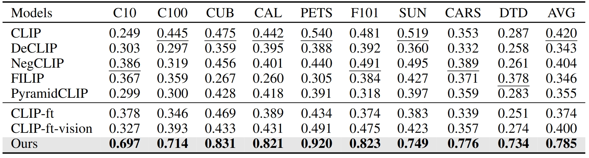

# Beyond Accuracy: Ensuring Correct Predictions with Correct Rationales (NeurIPS 2024)

[[Paper](https://arxiv.org/pdf/2411.00132)] [[Code](https://github.com/deep-real/DCP)] [[Video](https://www.youtube.com/watch?v=c23RWXeI0ok)] [[DeepREAL Lab](https://deep-real.github.io/)]

This repository holds the Pytorch implementation of [Beyond Accuracy: Ensuring Correct Predictions with Correct Rationales](https://arxiv.org/pdf/2411.00132) by [Tang Li](https://tangli0305.github.io/), [Mengmeng Ma](https://mengmenm.top/), and [Xi Peng](https://deep-real.github.io/dr_xipeng.html).
If you find our paper and code useful in your research, please consider citing:

```
@inproceedings{li2024beyond,
 title={Beyond Accuracy: Ensuring Correct Predictions with Correct Rationales},
 author={Li, Tang and Ma, Mengmeng and Peng, Xi},
 booktitle={Proceedings of the Annual Conference on Neural Information Processing Systems (NeurIPS)},
 year={2024}
}
```

## Introduction

Can we trust Large Foundation Models (LFMs) in their predictions? Our findings say NO! There are many unsafe prediction examples:


To address this issues, we propose Double-Correct Predictions (DCP). Please refer to our paper for method details.


## Pretrained Weights
- Fine-tuned on ImageNet: [DCP-ViT-B/32](https://drive.google.com/file/d/1lvuaYphFro-P4tA547pBK15owtp3rR5v/view?usp=sharing)


## Requirements

This repository reproduces our results on [ImageNet](https://www.image-net.org/download.php), [CIFAR-10/100](https://www.cs.toronto.edu/~kriz/cifar.html), [CUB](https://www.vision.caltech.edu/datasets/cub_200_2011/), [Caltech101](https://data.caltech.edu/records/mzrjq-6wc02), [OxfordPets](https://www.robots.ox.ac.uk/~vgg/data/pets/), [Food101](https://data.vision.ee.ethz.ch/cvl/datasets_extra/food-101/), [SUN397](https://vision.princeton.edu/projects/2010/SUN/), and [Stanford Cars](https://www.kaggle.com/datasets/jessicali9530/stanford-cars-dataset) datasets, please download these datasets as needed. Our code is build upon Python3 and Pytorch v2.0.1 on Ubuntu 18.04. Please install all required packages by running:

```
pip install -r requirements.txt
```


## Rationale Dataset

Our structured rationales capture the major attributes and their sub-attributes that lead to the recognition of objects. Our dataset offers ``over 4,000`` unique rationales covering all ``1,000`` categories from ImageNet. The dataset is in ``.JSON`` format:
```
./DCP/Rationale Dataset/rationale_imagenet.json
```

To curate customized rationale datasets, you will need to add your [OpenAI API](https://platform.openai.com/docs/api-reference/introduction) token and run the following notebook. Note that in notebook showcase our best prompt for *this task*, you can change to any category list as you want or modify the prompts as needed.
```
./DCP/generate_graph.ipynb
```
OpenAI will update their API library, please modify the code accordingly if needed.


## Rationale-informed Optimization

Before pretraining, please replace the paths in [load.py](https://github.com/tangli-udel/DEAL/blob/3d31d67638395af9dda938017882f73088105a99/load.py#L81) to your own datasets and run:

```
sh run_cross_recon.sh
```

Note that we parse the ontology graphs in the rationale dataset into visual concepts in ``./DCP/descriptors/my_imagenet.json``.

## Evaluations
We provide example code for reproducing zero-shot prediction accuracy and rationale disentanglability:


To evaluate the zero-shot prediction accuracy, please run:
```
./DCP/evaluation.ipynb
```


To evaluate rationale disentanglability, please run:
```
./DCP/disentanglability.ipynb
```

## Acknowledgement
Part of our code is borrowed from the following repositories.

- [Visual Classification via Description from Large Language Models](https://github.com/sachit-menon/classify_by_description_release)
- [Generic Attention-model Explainability for Interpreting Bi-Modal and Encoder-Decoder Transformers](https://github.com/hila-chefer/Transformer-MM-Explainability)
- [Interpreting CLIP's Image Representation via Text-Based Decomposition](https://github.com/yossigandelsman/clip_text_span)

We thank to the authors for releasing their codes. Please also consider citing their works.